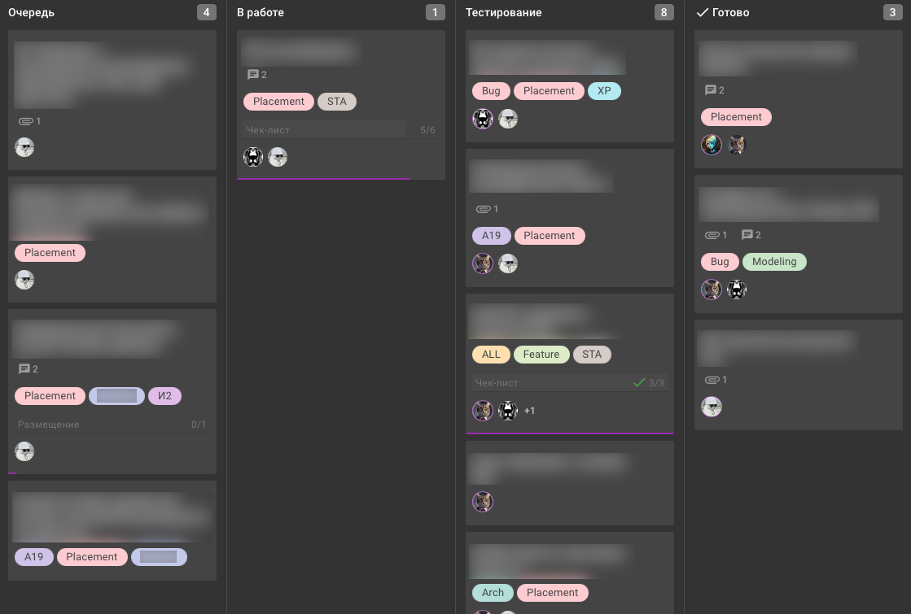
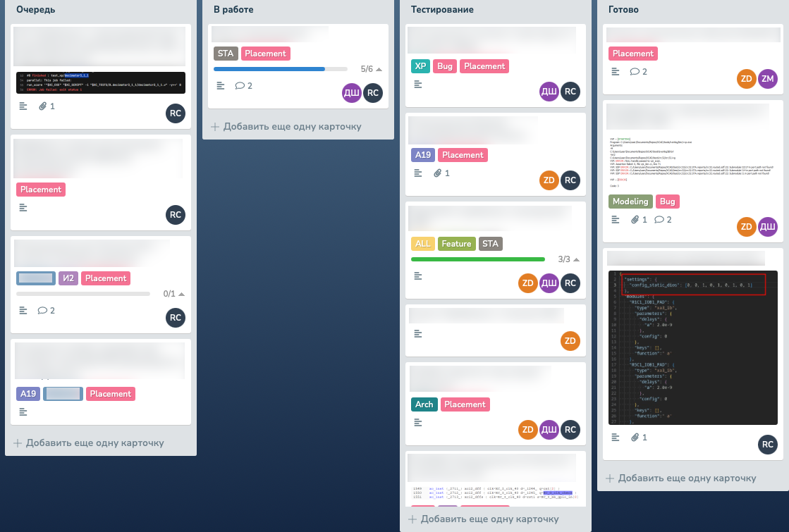

# kaiten-planka-migrator
Утилита для переноса данных из Kaiten в self-hosted PLANKA

# Как выглядят перенесённые данные
Board in Kaiten

Board in PLANKA

# Подготовка к переносу

Для успешного выполнения переноса данных в папке с проектом должен находиться файл `.env` с прописанными переменными.

| Имя переменной | Описание |
|---|---|
| `KAITEN_URL`  | Адрес вашего экземпляра Kaiten (например, https://example.kaiten.ru)  |
| `KAITEN_TOKEN`  | Токен доступа к Kaiten, получается в профиле  |
| `PLANKA_URL`  | Адрес вашего экземпляра PLANKA (например, https://planka.example.com)  |
| `PLANKA_TOKEN`  | Токен доступа к PLANKA для админского профиля, получается через API  |
| `ADMIN_EMAIL`  | Адрес почты, привязанный к админскому профилю PLANKA  |
| `ADMIN_PASSWORD`  | Пароль учётной записи администратора PLANKA (нужен для получения токенов созданных пользователей при переносе комментариев)  |

# Какие данные переносятся

- Пространства из Kaiten переностяся в проекты, если у пространств есть дочерние пространства
- Доски. Если доска расположена в дочернем пространстве, то при переносе ей будет назначено имя пространства, из которого она переносится
- Столбцы и карточки
- Метки карточек
- Прикреплённые файлы
- Сроки исполнения карточек
- Чек-листы
- Комментарии. Поскольку PLANKA у нас self-hosted, пользователей мы создаём сами при переносе, поэтому комментарии переносятся от имени тех же пользователей. Если пользователь Kaiten уже удалён, а комментарий остался, то перенесётся от имени администратора

